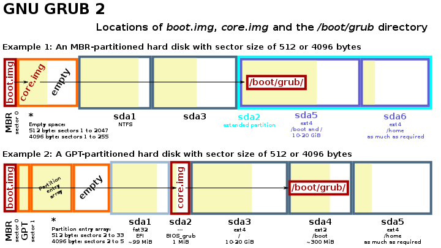

# GRUB

## Overview

- `GRUB2` is the standard `GRUB` version on modern systems, hence `GRUB2` is simply referred to as `GRUB` in the rest of this document 
- A disk can be configured as`MBR` or `GPT`, where the latter  supports more partitions per disk and larger disk size
- `GRUB` is a boot-loader package that allows the user to select the kernel (e.g.`vmlinuz-5.5.3`) and initial ramdisk (e.g. `initrd.img-5.5.3`) to use
- The available combinations of kernel and initial ramdisk are specified in `grub.cfg`

## Boot Stages



- A typical disk starts its first partition at sector 2048, as everything before that is reserved for storing boot information 
- After the BIOS, the system goes through a 3-stage boot process using `GRUB`

### 1st Stage

- `boot.img` is written to the section 0 by `grub-install`
- `boot.img` contains an address to `core.img`

### 2nd Stage

- For `MBR` disks, `core.img` is stored after `boot.mg` and before the first partition
- For `GPT` disks, `core.img` is stored in a separate `BIOS_grub` partition (Note: This is ***not*** the same as `/boot`)
  - Use `fdisk` to create a 1MB partition of type `BIOS boot partition`

- `core.img` uncompresses the `GRUB` kernel and loads `/boot/grub/<platform>/normal.mod`from the partition configured by `grub-install`
  - Note: `grub-install` creates `/boot/grub/`  
  - Note: `/boot/grub` can live in the root (`/`) partition or a separate `/boot` partition

### 3rd Stage

- `normal.mod` parses `/boot/grub/grub.cfg` and shows the `GRUB` menu

### UEFI

- Everything so far applies to `BIOS` systems, rather than `UEFI` systems
- For `UEFI` systems, `/efi/<distro>/grubx64.efi` is booted by the firmware directly in sector 0. In other words, there is no `boot.img`.

## grub.cfg

```
# An example /boot/grub/grub.cfg
set default=0
set timeout=5

insmod ext2
insmod part_msdos # For MBR disks
insmod part_gpt   # For GPT disks

set root=(hd0,msdos5) # The root directory of "/boot/vmlinuz-5.5.3" below

menuentry "GNU/Linux, Linux 5.5.3" {
        # "root=" is the mountpoint of the "real" root file system,
        # which may or may not be the same the same as "set root="
        linux   /boot/vmlinuz-5.5.3 root=/dev/sdb2 ro
        initrd  /boot/initrd.img-5.5.3
}
```

